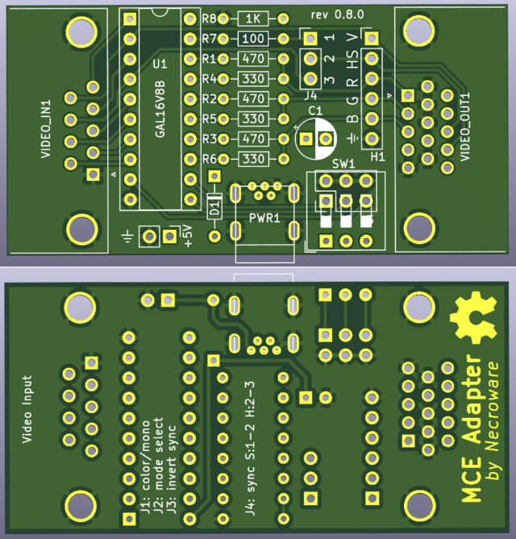

# MCE Adapter (Prototype!)

The MCA-Adapter is a device, which can convert MDA (and Hercules), EGA and CGA
to analogue RGBS signal. It supports following features.

- Converts digital MDA, Hercules, CGA and EGA to analog RGBS or RGBHV/VGA signal
- Color DAC for 3, 4, 16 and 64 color modes
- Switchable composite sync from H- and V-Sync
- Loop through HV-Sync, colors conversion only mode
- Includes IBM's "brown-hack"for CGA and 16-colors EGA modes
- Hi/Low resolution EGA mode autodect for proper color representation
- Switchable green, white and amber monochrome screen emulation

Youtube Videos:
- Part 1: Why GBS-8200 is not a CGA/EGA converter https://youtu.be/7c3yLX52ZEs
- Part 2: Theory and implementation https://youtu.be/aUFKB4b5KpE
- Part 3: Showtime https://youtu.be/F1685u-QQ0k

## Why did I make this?

Because why not? I wanted to get some practice with EDA and I needed such an
adapter to test some of my old graphics cards.

## Why might somebody need this?

If you want to connect your old PC with MDA, CGA or EGA graphics to a more
modern VGA display, it's going to be difficult. First of all, this old graphics
standards are digital, so RGB information is sent as a bunch of 1 and 0. VGA on
the other hand understands only analogue signals, so f.e. the intensity of the red
color is defined by some value between two voltages and not by a discrete value.
So the first job of this adapter is to translates digital video signals into
analogue video signals. However, this is may be not enough, since the horizontal
sync signal of the old video standards is not supported by a usual VGA monitor.
For this purpose, a very famous upscaler named GBS-8200 and compatible can be
used to convert the sync signal to VGA compatible level.  However, GBS-8200
expects such called composite sync signal, where horizontal and vertical sync
signals are combined. This is, where this adapter comes into place, it doesn't
only convert digital RGB signal to analogue, but also composite sync signal from
incoming horizontal and vertical signals. Long story short, you will need this
adapter to connect a MDA, CGA or EGA graphics card to an analogue RGB monitor,
either by using GBS-8200 converter or the adapter standalone, in case your
monitor supports horizontal frequencies down to 15kHz.

## Why didn't I take an existing solution?

Well, first of all, I wanted to gain some experience in this. Second, I actually
was heavily inspired by a YouTube video by TheRasteri, where he evaluates the
output possibilities of an old PC, talks about the technical background and
creates his own adapter. You can see the video here:

* Part 1: https://www.youtube.com/watch?v=kHhpTq-WSJk
* Part 2: https://www.youtube.com/watch?v=vwKA1z8tg1g

As I saw his solution with a ROM, I instantly thought, that the same thing can
be done using a programmable logic IC, like GAL16V8. It would have some benefits
in timing behaviour over a solution with ROM and be also very flexible. So, here
it is.

## Which modes does it support?

The adapter can convert MDA, Hercules, CGA, 16 colors EGA and 64 colors EGA to
standard VGA (RGBHV) or RGBS (combined HV-sync). The sync output frequency is
always the same as the input frequency. The adapter can only compose HV-sync,
but doesn't actively change it. The digital color signal is converted to analogue
color signal, so any analogue RGB monitor should understand it.

## Jumpers and switches

ATTENTION: Jumper settings changed compared to previous revisions 

Color mode selection J1:
Mode                       | 1-2 | 3-4 
---------------------------|-----|-----
CGA/EGA (15kHz / 21kHz)    | OFF | OFF 
MDA/Hercules white (18kHz) | ON  | ON
MDA/Hercules green (18kHz) | ON  | OFF
MDA/Hercules amber (18kHz) | OFF | ON

Sync selectiom J2:
Mode               | Setting
-------------------|----------
HV-Sync (VGA)      | 1-2
C-Sync (Composite) | 2-3

## How to use this stuff?

1. Take the gerber files and make a PCB.
2. Assemble the board
3. Compile code/mceplug.eqn using EQN2JED tool
4. Write the compiled jed file to a GAL16V8 IC
5. Put it into the board and connect the cables
   f.e. CGA -> MCE Adapter -> GBS-8200 -> Analog RGB Monitor

## Bill of materials

Reference  |#  |LCSC    |Description
-----------|---|--------|-------------------------------------
C1 C2      |2  |C2839237|capacitor 1µF
D1         |1  |C402218 |diode 1N5819
H1         |1  |C492405 |pin header 1x6
J1         |1  |C492419 |pin header 2x2
J2         |1  |C429954 |pin header 1x3
PWR1       |1  |C46398  |USB-B mini port
PWR2       |1  |C152154 |pin header 1x2 (+5V connector)
R1 R2      |2  |C119317 |resistor 470 Ohm
R3 R5 R7   |3  |C2848597|resistor 1.3k Ohm
R4 R6 R8   |3  |C119320 |resistor 680 Ohm
R9         |1  |C173139 |resistor 10k Ohm
U1         |1  |C6509   |GAL16V8B (or compatible)
VIDEO_IN1  |1  |C141882 |DB9 female connector (MDA/EGA/CGA)
VIDEO_OUT1 |1  |C75754  |DIB15 female connector (VGA)

## Tested with following monitors
- GBS-8200 with original hardware (only 15kHz modes work)
- GBS-8200 with gbs-control firmaware (Hercules and hi-res EGA sync unstable)
- NEC Multisync LCD1970NX 19" TFT (everything works fine, Hercules is not in full screen, but works stable)
- EIZO L365 15" TFT (only Hi-Res EGA works, doesn't support 15kHz CGA nor 50Hz Hercules)
- Benq BL702A
