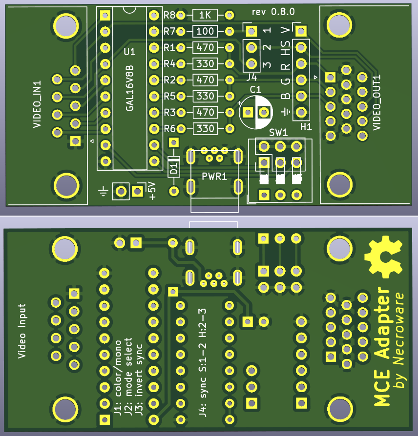

# MCE Adapter (Prototype!)

The MCA-Adapter is a device, which can convert MDA (and Hercules), EGA and CGA
to analogue RGBS signal.

# Why did I make this?

Because why not? I wanted to get some practice with EDA and I needed such an
adapter to test some of my old graphics cards.

# Why might somebody need this?

If you want to connect your old PC with MDA, CGA or EGA graphics to a more
modern VGA display, it's going to be difficult. First of all, this old graphics
standards are digital, so RGB information is sent as a bunch of 1 and 0. VGA on
the other hand understands only analogue signals, so f.e. the intensity of the red
color is defined by some value between two voltages and not by a discrete value.
So the first job of this adapter is to translates digital video signals into
analogue video signals. However, this is may be not enough, since the horizontal
sync signal of the old video standards is not supported by a usual VGA monitor.
For this purpose, a very famous upscaler named GBS-8200 and compatible can be
used to convert the sync signal to VGA compatible level.  However, GBS-8200
expects such called composite sync signal, where horizontal and vertical sync
signals are combined. This is, where this adapter comes into place, it doesn't
only convert digital RGB signal to analogue, but also composite sync signal from
incoming horizontal and vertical signals. Long story short, you will need this
adapter to connect a MDA, CGA or EGA graphics card to an analogue RGB monitor,
either by using GBS-8200 converter or the adapter standalone, in case your
monitor supports horizontal frequencies down to 15kHz.

# Why didn't I take an existing solution?

Well, first of all, I wanted to gain some experience in this. Second, I actually
was heavily inspired by a YouTube video by TheRasteri, where he evaluates the
output possibilities of an old PC, talks about the technical background and
creates his own adapter. You can see the video here:

* Part 1: https://www.youtube.com/watch?v=kHhpTq-WSJk
* Part 2: https://www.youtube.com/watch?v=vwKA1z8tg1g

As I saw his solution with a ROM, I instantly thought, that the same thing can
be done using a programmable logic IC, like GAL16V8. It would have some benefits
in timing behaviour over a solution with ROM and be also very flexible. So, here
it is.

# Which modes does it support?

The adapter can convert MDA, Hercules, CGA, 16 colors EGA and 64 colors EGA to
standard VGA (RGBHV) or RGBS (combined HV-sync). The sync output frequency is
always the same as the input frequency. The adapter can only compose HV-sync,
but doesn't actively change it. The digital color signal is converted to analogue
color signal, so any analogue RGB monitor should understand it.

# Jumpers and switches

Basic jumper description:
* J1 mono (jumper off) or color (jumper on)
* J2 mode select (depends on the color or mono mode)
* J3 invert composite sync signal (see composite signal)
* J4 composite sync (1-2) or HV-sync (2-3)

Mode selection:
Mode                       | J1  | J2  | J3
---------------------------|-----|-----|-----
MDA/Hercules white (18kHz) | OFF | OFF | ON
MDA/Hercules green (18kHz) | OFF | ON  | ON
CGA/EGA 16 colors (15kHz)  | ON  | OFF | OFF
EGA 64 color (21kHz)       | ON  | ON  | ON

# Composite sync signal

Every end of line the graphics adapter sends a so called H-Sync or horizontal
synchronization signal. Every end of the screen the graphics adapter sends so
called V-Sync or vertical synchronization signal. The history of this principle
goes many years back to cathode tubes, old TVs and monitors. This signals are
used for the retraction of the ray in the monitor, so it knows when to restart
to draw the next line or the whole screen. The history and the theory behind it
is quite long and is not the point here. Important to understand is that
different video modes, MDA, CGA, EGA are using different V- and H-Sync
frequencies. It is important for the monitor to be able to distinguish them and
it does by the frequency of the sync signals, but also by a polarity of the
signals. Sometimes one of the sync signals is high positive and sometimes it is
low positive. This also helps the monitor to detect it properly, but some
monitors don't take it into account and in such cases the Jumper J3 can be
helpful. If you have problems with the sync signal with one of the modes try to
flip this jumper to get the sync signal inverted. This jumper has however no
meaning, if you set the adapter to HV-sync mode (Jumper J4 to 2-3). Here is the
overview of the different video modes, their sync frequencies and sync
polarities:

Video Mode | H-Sync  | V-Sync
-----------|---------|-------
MDA        | + 18kHz | - 50Hz
CGA        | + 15kHz | + 60Hz
EGA low    | + 15kHz | + 60Hz
EGA high   | + 21kHz | - 60Hz

Usually, you only need to invert the composite sync signal only if V-Sync signal
is negative. In the columns H- and V-Sync + means high-positive and - means
low-positive sync signal. EGA exists in two variants low resolution of up to
640x200 and high resolution with up to 720x350, hence the higher H-Sync
frequency of 21kHz, since 15kHz are just not enough to draw 350 lines with 60Hz.

# How to use this stuff?

1. Take the gerber files and make a PCB.
2. Assemble the board
3. Compile code/mceplug.eqn using EQN2JED tool
4. Write the compiled jed file to a GAL16V8 IC
5. Put it into the board and connect the cables
   f.e. CGA -> MCE Adapter -> GBS-8200 -> Analog RGB Monitor

# Bill of materials

Reference  |#  |LCSC   |Description
-----------|---|-------|-------------------------------------
C1         |1  |C383039|electrolythic capacitor 220µF
D1         |1  |C402218|diode 1N5819
H1         |1  |C492405|pin header 1x6
J123       |1  |C65114 |pin header 2x3
J4         |1  |C429954|pin header 1x3
PWR1       |1  |C46398 |USB-B mini port
PWR2       |1  |C152154|pin header 1x2 (+5V connector)
R1 R2 R3   |3  |C58592 |resistor 680 Ohm
R4 R5 R6   |3  |C58608 |resistor 330 Ohm
R7         |1  |C57438 |resistor 100 Ohm
R8         |1  |C57435 |resistor 1k Ohm
U1         |1  |C6509  |GAL16V8 (or compatible)
VIDEO_IN1  |1  |C141882|DB9 female connector (MDA/EGA/CGA)
VIDEO_OUT1 |1  |C75754 |DIB15 female connector (VGA)

